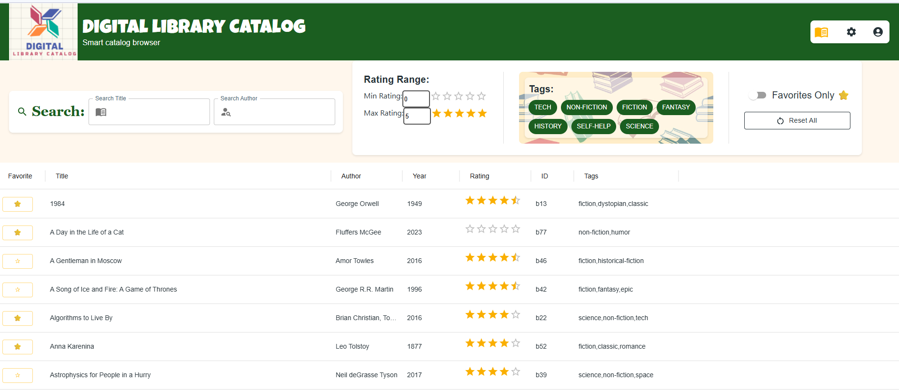
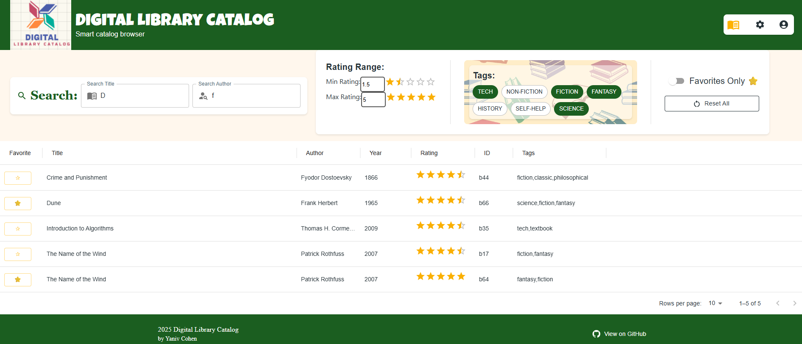
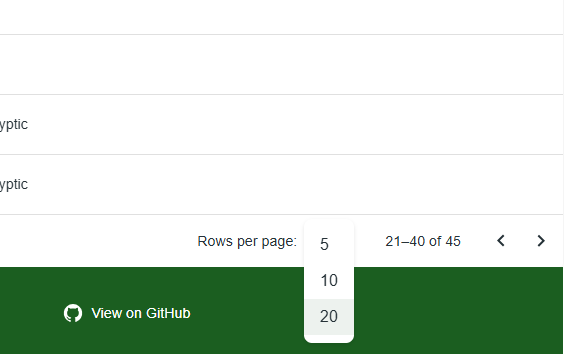
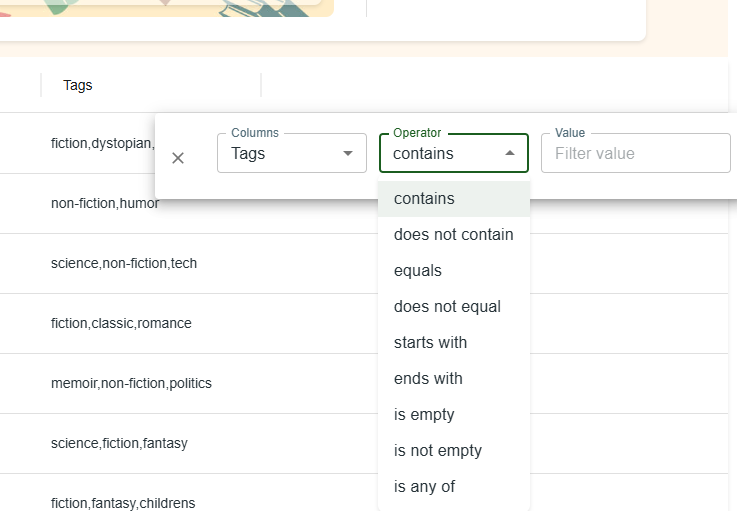

# 📚 Digital Library Catalog

### **Project Overview**

A modern React-based Library Catalog designed for academic and public browsing. This application leverages **TypeScript** for robust type safety and **Material UI (MUI)** to deliver a refined "Ivy League" aesthetic, focusing on visual hierarchy, accessibility, and high-performance data filtering.

This is the first project I have made primarily using MUI. After a long pause from web development, I had a great time making this page. I started by coding the filtering and sorting system myself, which was a successful learning experience—the website was functional but lacked the visual language of a mature application. MUI upgraded my design tremendously.

### **Tech Stack**

- **Frontend:** React 18
- **Styling:** Material UI (MUI) v5
- **Language:** TypeScript
- **Deployment:** GitHub Pages

### **🚀 Features**

- **"Ivy League" inspired UI:** A custom-themed design featuring deep greens and serif typography for an authentic library feel.
- **Multi-Criteria Filtering:** \* **Range Search:** A visual rating filter allowing users to define minimum and maximum star ratings, using memoization for performance.
- **Sorting:** Efficient Client-side Sorting: Optimized data organization that targets only the filtered subset of books.

- **Global Search:** Integrated title and author search with real-time feedback.
- **Accessibility & UX:**

  - Full keyboard navigation support (Enter/Tab) for interactive switches and buttons.
  - Responsive design optimized for both mobile and desktop viewports.
  - Sticky footer with automated copyright year and GitHub integration.

- **Favorites System:** Ability to toggle and isolate "Favorite" books with a single click.

---

### **🛠️ Installation & Setup**

To run this project locally, ensure you have **Node.js** installed, then follow these steps:

1. **Clone the repository:**

```bash
git clone https://github.com/your-username/library-app.git
cd library-app

```

2. **Install dependencies:**

```bash
npm install

```

3. **Start the development server:**

```bash
npm start

```

---

### **💡 Project Structure**

- `src/theme/`: Contains the global MUI `ThemeProvider` configuration.
- `src/hooks/`: Includes custom hooks like `useMenu` for cleaner state management of UI components.
- `src/components/`: Modular, reusable UI components (Header, Footer, FilterPanel).

---

### **👨‍💻 Author**

**Yaniv Cohen**
Another React Project I made - including both Front and Back end development https://bul-pgia.onrender.com/ | [LinkedIn Profile](https://www.linkedin.com/in/yaniv-cohen-tech)

---

### **📷 Screenshots:**

_
_
_
_
